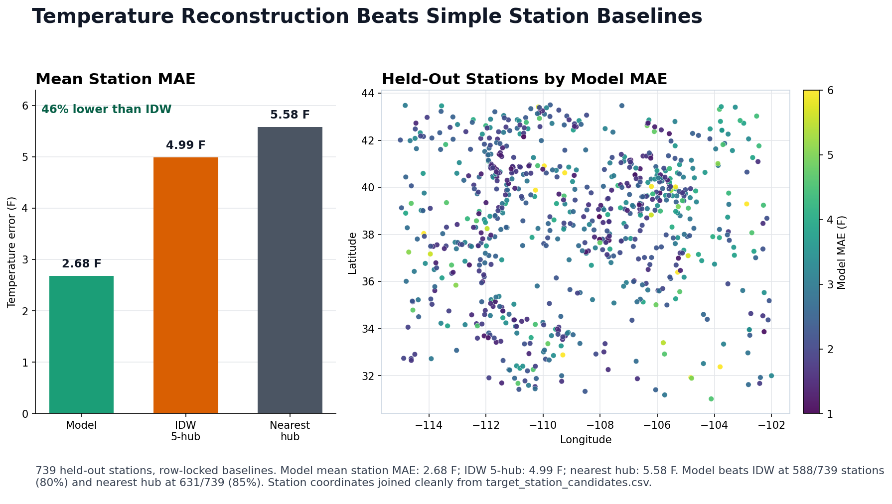

# Colorado River Basin Weather Reconstruction

[](https://github.com/alla8967/colorado-river-basin-weather/actions/workflows/check.yml)

A full-stack station proxy and daily temperature reconstruction project for the Colorado River Basin, combining NOAA station data, a persistent C++ matching engine, FastAPI, and row-locked model validation evidence.

Pick any point in the basin: the app finds the nearest station, ranks long-record proxy stations, and shows reconstruction reliability evidence for that location. The modeling side is backed by a 739-station holdout where model predictions are compared against nearest-hub and IDW baselines on the same rows.



**Headline result:** Mean station MAE fell from 4.99 F with IDW interpolation to 2.68 F with the model, a ~46% reduction across 739 held-out stations.

## Quick Start

```bash
make demo
```

`make demo` creates `.venv` if needed, installs `.[dev]`, builds the C++ server, launches FastAPI against tracked fixture files, and prints:

```text
open http://127.0.0.1:8000
```

Use the preset buttons for Denver, Grand Junction, and Lake Havasu to run a fixture-backed location analysis quickly.

## Architecture

```text
Browser frontend
-> FastAPI backend
-> persistent C++ station engine
-> app-ready NOAA station CSVs

NOAA/terrain preprocessing
-> reconstruction training tables
-> Paloma model artifacts
-> row-locked holdout comparison reports
-> reliability surfaces served by FastAPI
```

The project has four main lanes:

- `station-proxy-backend/`: FastAPI routes, browser UI, reliability map, and result rendering.
- `C++_Weather_Station_Proxy_Engine/` and `Station_Engine_Server/`: reusable station matching logic plus a persistent stdin/stdout server so large station CSVs load once.
- `NOAA_Inventory_Sort/`: station inventory filtering and curated station candidate inputs.
- `weather_reconstruction_model/`: reconstruction scripts, model-run records, comparison reports, and reliability artifact readers.

## Results

The portfolio claim uses existing row-locked comparison artifacts only:

| Metric | Model | IDW 5-hub | Nearest hub |
| --- | ---: | ---: | ---: |
| Mean station MAE | 2.68 F | 4.99 F | 5.58 F |
| Strict passes | 52 | 9 | 8 |

Additional verified holdout facts:

- 739 held-out stations and 416,892 held-out rows.
- Model beats IDW at 588 / 739 stations (80%).
- Model beats nearest hub at 631 / 739 stations (85%).
- Median model station MAE is 2.49 F; p90 model station MAE is 4.00 F.

Sources: `weather_reconstruction_model/MODEL_RUNS.md`, `weather_reconstruction_model/outputs/reports/comparisons/paloma_v1_tavg_holdout_baseline_comparison_summary.json`, and `weather_reconstruction_model/outputs/reports/comparisons/paloma_v1_tavg_holdout_baseline_comparison_station_comparison.csv`.

Regenerate the figure after installing the optional plotting extra:

```bash
.venv/bin/python -m pip install -e ".[viz]"
.venv/bin/python weather_reconstruction_model/scripts/build_portfolio_figure.py
```

## How It Works

1. A user enters coordinates or clicks a preset location.
2. FastAPI asks the persistent C++ engine to find the nearest station.
3. If the nearest station is target-only, the engine ranks eligible hub stations as proxies; if it is already a hub, it ranks similar hubs.
4. The frontend displays nearest station details, ranked proxy stations, charts, and map overlays.
5. The reliability view serves precomputed Paloma v1 artifacts for model-run inspection.

The reconstruction model evidence is separate from the live fixture demo: holdout reports are stored under `weather_reconstruction_model/outputs/reports/comparisons/`, while the demo uses tiny tracked files in `tests/fixtures/`.

## Demo

For a fixture-only app run that does not require full NOAA data:

```bash
make demo
```

For a manual backend run with full local app-ready data, build and start the server:

```bash
make server
make run-backend
```

Then open `http://127.0.0.1:8000/`. The first full-data startup can be slow because the C++ engine loads station CSVs into memory; later requests reuse the loaded process.

## App Screenshots

Screenshots are not embedded until a full-width browser capture with fully rendered map tiles is available. See `docs/screenshots.md` for the exact capture steps and filenames.

## Development

Run the main fixture validation set:

```bash
make check PYTHON=.venv/bin/python
```

Run the model-script pytest suite when changing research/model helpers:

```bash
PYTHON=.venv/bin/python make test-python
```

Do not retrain models, refresh holdout validation, or stage generated NOAA/model artifacts as part of normal app review. The CI workflow delegates to `make check` and does not download full NOAA data or train models.

## Limitations

This is a basin-scoped research and local-demo project, not a packaged production weather service. The holdout evidence is strong for the current Colorado River Basin station corpus, with these boundaries:

- The app and model evidence are scoped to Colorado River Basin / in-basin use.
- PRISM and Daymet comparisons have not been run yet.
- Strict-pass criteria are still mostly unmet: 52 model passes out of 739 held-out stations.
- The production final-model fit served by the app is distinct from the grouped holdout evidence summarized above.
- Full NOAA data products, DEM products, model runs, and serialized model artifacts are not bundled with the public repo.

## Reviewer/Runbook Links

- `PROJECT_MAP.md`: top-level navigation and what to ignore while browsing.
- `docs/reviewer_runbook.md`: setup, validation, local run steps, Alpine safety, and the archived pre-portfolio README text.
- `docs/artifact_quarantine_plan.md`: generated artifact shelves and safe cleanup policy.
- `docs/generated_artifact_audit.md`: commit/staging policy for generated files.
- `docs/research_script_inventory.md`: research/model script map.
- `docs/screenshots.md`: app screenshot capture instructions.
- `weather_reconstruction_model/MODEL_RUNS.md`: verified model-run claims and artifact pointers.
